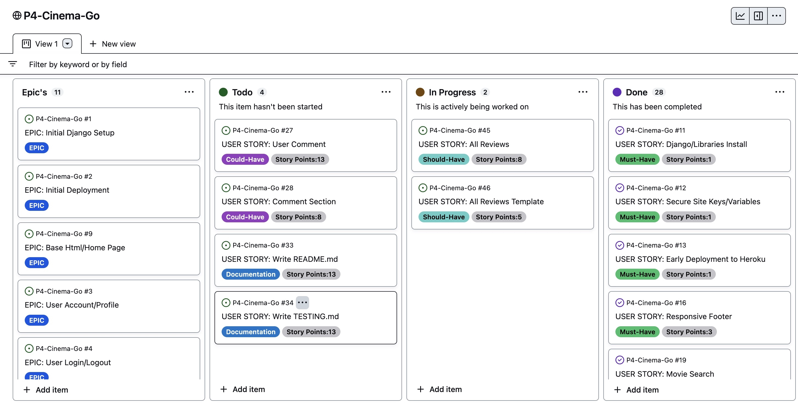
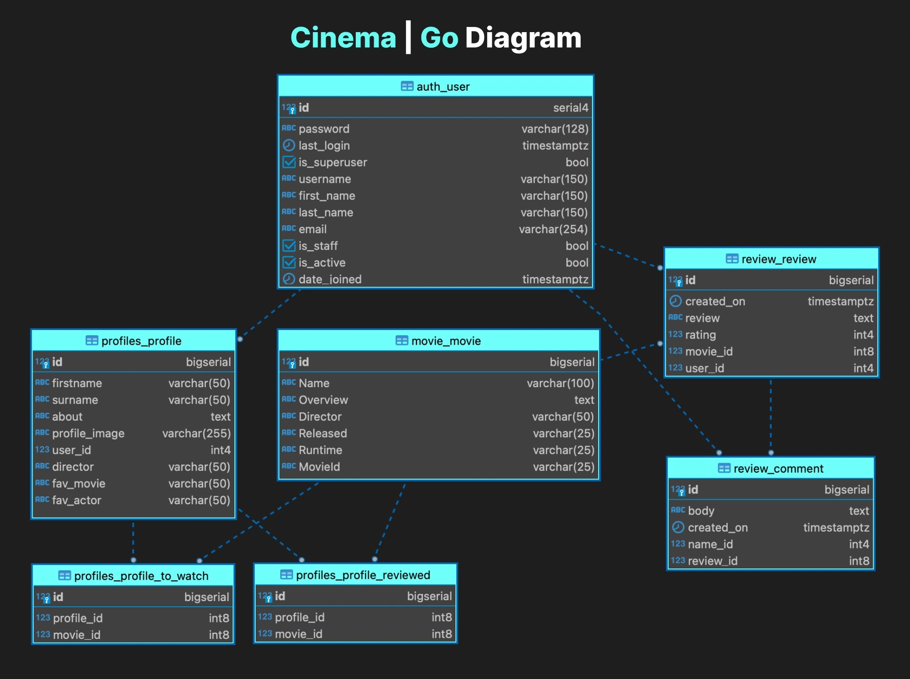

# **Cinema | Go**

## **Overview**

Cinema | Go is a Movie site designed to allow a User to find and review Movies. The site features a search function using the TMDB API that allows users to search for any Movie they wish. There is a Trending and Top Rated section too so users can view the most popular Movies today and the highest rated of all time. Users will be able to view Movie details such as Title, Director, Overview, Trailers, etc. Users will also be able to review Movies and add Movies to a watchlist that can be displayed on their customizable Profile page, here they will be able to enter information about themselves and upload their Profile picture. You are not authorized to delete this review.

Developed by Sean Finn.

[Cinema | Go - Live Webpage](https://cinema-go-p4.herokuapp.com/) (Right-click to open in a new tab)

## **Project Goals**

This is my fourth portfolio project for [Code Institute](https://codeinstitute.net/) and my goal with this project is to display my newly acquired skills with frameworks such as Bootstrap and Django. I decided to build a Movie based review site that works in tandem with the TMDB API.

## **Contents**

1. [Overview](#overview)
1. [Project Goals](#project-goals)
1. [UX](#ux)
    - [The Strategy Plane](#the-strategy-plane)
        - [The Ideal User](#the-ideal-user)
        - [Site Goals](#site-goals)
    - [Agile Planning](#agile-planning)
        - [Epics](#epics)
        - [User Stories](#user-stories)
    - [The Skeleton Plane](#the-skeleton-plane)
        - [Wireframes](#wireframes)
        - [Database Schema](#database-schema)
        - [Security](#security)
    - [The Scope Plane](#the-scope-plane)
    - [The Structure Plane](#the-structure-plane)
        - [Features](#features)
        - [Future Features](#future-features)
    - [The Service Plane](#the-service-plane)
        - [Design](#future-features)
            - [Colour Scheme](#colour-scheme)
            - [Typography](#typography)
            - [Imagery](#Imagery)
1. [Technologies Used](#technologies-used)
    - [Languages Used](#languages-used)
    - [Frameworks and Tools Used](#frameworks-and-tools-used)
    - [Libraries Used](#libraries-used)
1. [Testing](#testing)
1. [Deployment](#deployment)
1. [Credits](#credits)
1. [Acknowledgements](#acknowledgements)

## **UX**

## **The Strategy Plane**

Cinema | Go is intended to bring together all Movie lover's to find their favourite Movies and discover new ones. Users will be able to review and rate Movies and create their watchlist which they can manage from their custom Profile page. The graphical elements and overall design of the site provide the user with an enjoyable experience with an aesthetically pleasing display.

### **The Ideal User**

- Someone who enjoys movies and would like to discover new movies
- Someone who would like to review/rate movies and share those reviews with fellow movies lovers
- Someone who would like to create a watchlist of movies and share it with others
- Someone who would like to create their own custom Profile page, share some information about themselves and their Movie interests

### **Site Goals**

- To provide users with a place to find movies they have seen and discover new ones
- To provide users with the ability to review/rate movies
- To provide users with the ability to create their own Profile and movie watchlist
- To provide users with the ability to view other users reviews and watchlists

[Back to top &uarr;](#contents)

## **Agile Planning**

This project was developed using agile methodologies by delivering small features across the duration of the project. All User Stories were assigned to Epics, prioritized under the labels, Must Have, Should Have and Could Have. They were assigned story points according to complexity. Story points were adjusted mid-project to use the common Fibonacci sequence correctly. "Must Have" stories were completed first, "Should Have's" and then finally "Could Have's".

It was done this way to ensure that all core requirements were completed first to give the project a complete feel. In some scenarios, certain "Could Have's" were implemented before schedule due to the easy nature of the implementation i.e. Trending/Top Rated Movies. The rest were applied based on capacity and timing.

The Kanban board was created using Github projects and can be located [here](https://github.com/users/seanf316/projects/7)  and can be viewed to see more information on the project cards. All stories have a full set of acceptance criteria to define the functionality that marks that story as complete.

### **Epics**

11 Epics (milestones) were created which were then further developed into 34 User Stories. The details on each epic, along with the user stories linked to each one can be found in the project kanban board linked above. 2 extra unplanned User Stories were created during development as an extra feature for the user - Trending Movies & Toprated Movies. They were added as the time to implement was very short and did not require an Epic.

#### **EPIC: Initial Django Setup [#1](https://github.com/seanf316/P4-Cinema-Go/issues/1)**
`
As a Developer, I can setup Django and start project, so that I can develop the site
`

The Initial Django Setup epic was required to setup the project and confirm libraries, frameworks etc were installed correctly. Only then could further development progress.

#### **EPIC: Initial Deployment [#2](https://github.com/seanf316/P4-Cinema-Go/issues/2)**
`
As a Developer, I can deploy my site with Heroku, so that user's can view and interact with the site
`

The Initial Deployment epic was completed early on as we were advised during the course material that early deployment is critical to avoid any issues down the line with the production app. Heroku app was creating and config vars were updated, app was linked to my projects Github repo for automatic deployments.

#### **EPIC: Base Html/Homepage [#9](https://github.com/seanf316/P4-Cinema-Go/issues/9)**
`
As a Developer, I can design a nice aesthetically pleasing Homepage, so that the user has an enjoyable experience when navigating site
`

The Base Html/Homepage epic was used to link various User Stories based around the design and responsiveness of the site. The Base template was created first so I could extend within further templates and then the homepage(index.html) was built using bootstrap and styled. Nav and Footer were progressed under seperate User Stories.

#### **EPIC: User Account/Profile [#3](https://github.com/seanf316/P4-Cinema-Go/issues/3)**
`
As a Developer, I can provide account/profile creation functionality, so that user can create/read/update or delete their account/profile
`

The User Account/Profile epic is for all User Stories related to the setup of the account/profile and the CRUD functionality and templates design.

#### **EPIC: User Signup/Login/Logout [#4](https://github.com/seanf316/P4-Cinema-Go/issues/4)**
`
As a Developer, I can provide Signup/Login/Logout functionality, so that user can safely signup/login/logout and prevent access to their profile
`

The User Signup/Login/Logout epic is for all User Stories related to the registration, login and authorization of views.

#### **EPIC: Movie Search [#5](https://github.com/seanf316/P4-Cinema-Go/issues/5)**
`
As a Developer, I can provide the Movie search functionality, so that User can easily search for movies to review
`

The Movie Search epic is for all User Stories related to the setup of the Movie search functionality and the use of the TMDB API. Any templates created or styled were linked also.

#### **EPIC: View Search Results [#6](https://github.com/seanf316/P4-Cinema-Go/issues/6)**
`
As a Developer, I can provide search results display, so that the user can view all Movies related to their search
`

The View Search Results epic is for all User Stories related to the search results page and displaying the results from the API call. Any templates created or styled were linked also.

#### **EPIC: View Movie Details [#7](https://github.com/seanf316/P4-Cinema-Go/issues/7)**
`
As a Developer, I can provide a display of the Movie details, so that user can view the Movie details for the Movie they selected
`

The View Movie Details epic is for all User Stories related to the Movie details page and displaying the Movie information such as Title, Overview, Director etc. Any templates created or styled were linked also.

#### **EPIC: Movie Reviews/Comments [#8](https://github.com/seanf316/P4-Cinema-Go/issues/8)**
`
As a Developer, I can provide review/comment functionality, so that registered users can review a Movie or comment on an existing Movie review
`

The Movie Reviews/Comments epic is for all User Stories related to the Review and Comment functionality. Any templates created or styled were linked also.

#### **EPIC: Status Error Templates [#11](https://github.com/seanf316/P4-Cinema-Go/issues/29)**
`
As a Developer, I can create Status Error templates, so that I can secure my views and advise User when there is an issue
`

The Status Error Templates epic is for all User Stories related to providing status error feedback to the User like 403, 404 and 500 status errors. Any templates created or styled were linked also.

#### **EPIC: Complete Documentation [#10](https://github.com/seanf316/P4-Cinema-Go/issues/10)**
`
As a Developer, I can create documentation, so that fellow developers can understand what the site is and how it was built
`

This epic is for all document related stories and tasks that are needed to document the software development lifecycle of the application. It aims to deliver quality documentation, explaining all stages of development and necessary information on running, deploying and using the application.

[Back to top &uarr;](#contents)

### **User Stories**

The following user stories (by epic) were completed throughout development.

#### **EPIC: Initial Django Setup [#1](https://github.com/seanf316/P4-Cinema-Go/issues/1)**

- As a Developer I can set up Django and install the supporting libraries predicted to be needed so that I am ready to start development [#11](https://github.com/seanf316/P4-Cinema-Go/issues/11)
- As a Developer I need to create the env.py and add to .gitignore so that I can securely deploy the site without exposing developer keys/information [#12](https://github.com/seanf316/P4-Cinema-Go/issues/12)

#### **EPIC: Initial Deployment [#2](https://github.com/seanf316/P4-Cinema-Go/issues/2)**

- As a Developer I can deploy site to Heroku early so that I can confirm everything works before development of the site and to enable continuous testing within the production environment [#13](https://github.com/seanf316/P4-Cinema-Go/issues/13)

#### **EPIC: Base Html/Homepage [#9](https://github.com/seanf316/P4-Cinema-Go/issues/9)**

- As a User I would like to view the site on my different devices so that I can view the site on the go [#14](https://github.com/seanf316/P4-Cinema-Go/issues/14)
- As a User I want to see a clear way of navigating the site so that I can find the information relative to my needs [#15](https://github.com/seanf316/P4-Cinema-Go/issues/15)
- As a User I want to be able to get in touch with the Developer so that I can enquire about issues/suggestions I may have [#16](https://github.com/seanf316/P4-Cinema-Go/issues/16)

#### **EPIC: User Account/Profile [#3](https://github.com/seanf316/P4-Cinema-Go/issues/3)**

- As a User I would like access to my Profile so that I can upload an image or alter my details where needed [#18](https://github.com/seanf316/P4-Cinema-Go/issues/18)
- As a Developer I can create an aesthetically pleasing display of the User's Profile so that the experience of viewing their Profile is a pleasant one [#23](https://github.com/seanf316/P4-Cinema-Go/issues/23)
- As a Developer I can create an edit Profile template so that the User has a nice display for when they want to update their Profile [#40](https://github.com/seanf316/P4-Cinema-Go/issues/40)
- As a Developer I can create a Delete Profile view so that the User has access to delete their account. [#41](https://github.com/seanf316/P4-Cinema-Go/issues/41)
- As a User I would like the ability to add Movies to a watchlist so that so that I can have a list of movies that I can refer to when looking for something to watch [#42](https://github.com/seanf316/P4-Cinema-Go/issues/42)

#### **EPIC: User Signup/Login/Logout [#4](https://github.com/seanf316/P4-Cinema-Go/issues/4)**

- As a User I want to Sign Up/Login and Logout so that I can see what features are available to registered users like reviewing/commenting [#17](https://github.com/seanf316/P4-Cinema-Go/issues/17)

#### **EPIC: Movie Search [#5](https://github.com/seanf316/P4-Cinema-Go/issues/5)**

- As a User I want to have a section where I can search for a Movie so that I can easily find the Movie I want to review [#19](https://github.com/seanf316/P4-Cinema-Go/issues/19)
- As a Developer I can create the Movie Search Template so that the User has an nice experience on the site [#20](https://github.com/seanf316/P4-Cinema-Go/issues/20)
- As a Developer I need to setup an account with TMDB so that I can use the sites API and implement into my site [#21](https://github.com/seanf316/P4-Cinema-Go/issues/21)

#### **EPIC: View Search Results [#6](https://github.com/seanf316/P4-Cinema-Go/issues/6)**

- As a Developer I can create the Movie Search Results template so that the User has a clear display of the results from their search [#37](https://github.com/seanf316/P4-Cinema-Go/issues/37)

#### **EPIC: View Movie Details [#7](https://github.com/seanf316/P4-Cinema-Go/issues/7)**

- As a User I want to view the Movie details from my search so that I can read the synopsis and check reviews [#22](https://github.com/seanf316/P4-Cinema-Go/issues/22)
- As a Developer I can build a page to display the Movie Details for the users selected Movie so that they have a clear overview of the Movie [#24](https://github.com/seanf316/P4-Cinema-Go/issues/24)
- As a Developer I will create a Movie model so that the movie details that the user references can be saved to the database for use with Reviews/Profile etc [#38](https://github.com/seanf316/P4-Cinema-Go/issues/38)

#### **EPIC: Movie Reviews/Comments [#8](https://github.com/seanf316/P4-Cinema-Go/issues/8)**

- As a User I want the ability to review Movies so that I can share my thoughts of the Movie with family and friends [#25](https://github.com/seanf316/P4-Cinema-Go/issues/25)
- As a Developer I can create a nice display for the User to review so that they have an enjoyable experience reviewing Movies on the site [#26](https://github.com/seanf316/P4-Cinema-Go/issues/26)
- As a User I would like the ability to edit my review so that I can fix and spelling or format issues [#43](https://github.com/seanf316/P4-Cinema-Go/issues/43)
- As a User I would like the ability to delete my review so that I can manage my reviews and in the case of accidentally selecting the wrong Movie and reviewing it [#44](https://github.com/seanf316/P4-Cinema-Go/issues/44)
- As a User I would like the ability to view all movie reviews so that I can see what my fellow reviewers think of other movies [#45](https://github.com/seanf316/P4-Cinema-Go/issues/45)
- As a Developer I can create an All Reviews page so that the User can have a nice display containing all reviews [#46](https://github.com/seanf316/P4-Cinema-Go/issues/46)
- As a User I would like the ability to comment on Reviews so that so that I can participate in conversations with fellow reviewer's [#27](https://github.com/seanf316/P4-Cinema-Go/issues/27)
- As a Developer I can create a section on the Review page for comments so that User's can comment on reviews [#28](https://github.com/seanf316/P4-Cinema-Go/issues/28)

#### **EPIC: Status Error Templates [#11](https://github.com/seanf316/P4-Cinema-Go/issues/29)**

- As a Developer I can implement a 403 error page to redirect unauthorised users so that I can secure my views [#30](https://github.com/seanf316/P4-Cinema-Go/issues/30)
- As a Developer I can implement a 404 error page so that I can alert users when they have accessed a page that doesn't exist [#31](https://github.com/seanf316/P4-Cinema-Go/issues/31)
- As a Developer I can implement a 500 error page so that I can alert users when an internal server error occurs [#32](https://github.com/seanf316/P4-Cinema-Go/issues/32)

#### **EPIC: Complete Documentation [#10](https://github.com/seanf316/P4-Cinema-Go/issues/10)**

- Create/Write README.md [#33](https://github.com/seanf316/P4-Cinema-Go/issues/33)
- Create/Write TESTING.md [#34](https://github.com/seanf316/P4-Cinema-Go/issues/34)

#### **Others**

- As a Developer I can build a page to display Trending Movies so that the User can see the latest Trending Movies [#35](https://github.com/seanf316/P4-Cinema-Go/issues/35)
- As a Developer I can build a page to display the Top Rated Movies so that the User can easily get access to the Top Rated Movies of all time [#36](https://github.com/seanf316/P4-Cinema-Go/issues/36)

[Back to top &uarr;](#contents)

## **The Skeleton Plane**

#### **Wireframes**

This is the prototype of the project that may change during its development.

Desktop

Tablet

Mobile

#### **Database Schema**

The Profile model is linked directly to the built in UserModel in conjunction with Djano Allauth with the user Profile setup to be created upon user registration. The Review model has a relationship with the User/Movie models linked by a Foreign key, this allows for reviewed movies to be linked back to the specific user and their Profile. The Comment model is linked by Foreign key to the Review Model to store comments for the specific Review.

The Movie model is also linked to the Profile model through a Many to Many relationship allowing the user to store Movies on their watchlist.

Entity relationship diagram was created using [DBeaver](https://dbeaver.io/) and shows the schemas for each of the models and how they are related.

#### **Security**

Views were secured where needed using the Django decorator @login_required. Access to the views using the @login_decorator can only be accessed by registered users. This means that if a user tries to access a view that is decorated with @login_required, but they are not currently logged in, they will be redirected to the login page instead.

Environment variables were stored in an env.py for local development for security purposes to ensure no secret keys, API keys, or sensitive information was added to the repository. In production, these variables were added to the Heroku config vars within the project.

[Back to top &uarr;](#contents)

## **The Scope Plane**

* Responsive Design - The site should be fully functional on all devices from 320px up
* Hamburger menu for mobile devices
* Ability to perform CRUD functionality on Profiles, Reviews, and Comments
* Restricted role-based features such as Reviewing/Commenting, viewing Movie Details, and editing Profile
* Home page describing the site and links to features for registered users

[Back to top &uarr;](#contents)

## **The Structure Plane**

### **Features**
`
As a User I would like to view the site on my different devices so that I can view the site on the go
`

**Navbar**

`
As a User I want to see a clear way of navigating the site so that I can find the information relative to my needs
`

The Navbar contains links for Home, a Movies dropdown containing Search/Trending/TopRated, Reviews, Profile, and allauth options.

The following navigation items are available on all pages:
  * Home -> index.html - Visible to all
  * Movies (Drop Down):
    * Search -> search.html - Visible to logged in users
    * Trending -> trending.html - Visible to logged in users
    * Top Rated -> toprated.html - Visible to logged in users
  * Reviews -> allreviews.html - Visible to logged in users
  * Profile -> profile.html - Visible to logged in users
  * Signup -> signup.html - Visible to logged out users
  * Login -> login.html - Visible to logged out users
  * Logout -> logout.html - Visible to logged in users

The navigation menu is displayed on all pages and drops down into a hamburger menu on smaller devices. This will allow users to view the site from any device and not take up too much space on mobile devices. It is easily noticeable, intuitive, and easy to use.

**Footer**

`
As a User I want to be able to get in touch with the Developer so that I can enquire about issues/suggestions I may have
`

The footer is placed at the bottom of the page. The social media links are displayed with icons provided by Font Awesome. There is also a small portion of text for the Copyright/Disclaimer. This is where the user can click on a social media link and reach out to the developer for news and updates. A link to the developer's Github repository is provided and displayed using the Font Awesome Github icon. These icons have aria labels added to ensure users with assistive screen reading technology know the purpose of the links. They also open new tabs as they lead users away from the site.

**Homepage**

There are two variations of the Home page that change based on User login/registration. Users that have not signed up will be met with a welcome message and some information about the site. Details of features available to registered Users are shown and a Sign-Up button is provided. The site Hero image (Lego Movie) is also provided.

Users that have registered and logged in will be met with a similar layout but this time there will be buttons linking the user to various Movie features to get started.

**Movie Search**

`
As a User I want to have a section where I can search for a Movie so that I can easily find the Movie I want to review
`

The Movie Search page has a similar layout to the Home page as it includes the hero image but this time a search input is provided and a search button to execute the users' Movie search. The search feature works in tandem with the TMDB and makes an API based on the query the user enters.

**Movie Search Results**

`
As a Developer I can create the Movie Search Results template so that the User has a clear display of the results from their search
`

The Search Results page is displayed with the users' Movie search query at the top of the page and for each Movie received in the results of the API call a card is generated containing the Movie backdrop image, the title of the movie, and a "View Movie" button. If a backdrop image is not available for Movies in the results a default image has been provided as backup. I have set the results to display 12 movies per page, this was a design choice to have an even layout across devices. Prev/Next buttons are displayed at the bottom of the page for pagination with the views.

In the occurrence where no results for the query are available a message will be displayed to the user along with a button linking the user back to the Movie Search page.

**Trending/Top Rated Movies**

`
As a Developer I can build a page to display Trending Movies so that the User can see the latest Trending Movies
`

`
As a Developer I can build a page to display the Top Rated Movies so that the User can easily get access to the Top Rated Movies of all time
`

There are two Movie category pages provided for the user - Trending & Top Rated. They were not in the original scope of the project but during development, I decided to implement them as an extra feature for the user. Each page makes a call to the TMDB API and displays the most up-to-date results on the page to the user in the form of Movie posters. Each Movie poster is an anchor that can be clicked and will bring the user to the Movie Details page for that selected Movie. If a poster image is not available for Movies in the results a default image has been provided as a backup. I have set the results to display 18 movies per page, this was a design choice to have an even layout across devices. Prev/Next buttons are displayed at the bottom of the page for pagination with the views.

**Movie Details**

`
As a User I want to view the Movie details from my search so that I can read the synopsis and check reviews
`

`
As a User I would like the ability to add Movies to a watchlist so that so that I can have a list of movies that I can refer to when looking for something to watch
`

Registered users can access the Movie Details page.

The Movie Details page contains all the details of the Movie selected by the user from the pages mentioned above. A horizontal card layout is used to display the following details from the API - Movie poster/backdrop, title, overview, director, runtime, and release year. A rating is provided too if the Movie has been reviewed, it retrieves all the ratings from all user reviews for this specific movie and shows the average rating. Buttons for Trailer and IMDb are displayed if they are contained in the movie results from the API call. If a trailer does exist users can click the trailer button and a modal will appear containing that movie trailer. If there is an IMDb id provided the button will bring the user to the movies' IMDb page in a new tab.

2 more buttons are displayed to the user "Add to Watchlist +" and "Review". Clicking the "Add to Watchlist +" will add the movie to the user's watchlist which can be viewed on the user's Profile page. Clicking the "Review" button will open the Review form page and allow the user to submit a review which again will be linked back to their Profile page where they can view all reviewed Movies. If a user has added the movie to their watchlist the button will change to "Remove from Watchlist -" and this can be toggled again to remove the Movie from the user's watchlist. User can manage their watchlist from their Profile page. If the movie has been reviewed by the user the "Review" button will now display "Reviewed", users can manage (Edit/Delete) their reviews from the All Reviews page or can manage reviews directly from their Profile page.

**Reviews**

`
As a User I want the ability to review Movies so that I can share my thoughts of the Movie with family and friends
`

`
As a User I would like the ability to edit my review so that I can fix and spelling or format issues
`

`
As a User I would like the ability to delete my review so that I can manage my reviews and in the case of accidentally selecting the wrong Movie and reviewing it
`

Creating and viewing reviews are features only available to registered users.

When the user clicks the Review button on the Movie Details page they will shown brought to the Review page that contains the Review form for the user to fill out. The page contains the backdrop image for that movie, the movie title, the reviewer's username, and the form itself. There are 2 inputs on the form "Review (Max 2500 Characters)" and "Rating (1-10)" with 2 buttons "Update" and "Delete". When the form is filled out correctly the user can submit their review, by submitting the review will be added to the user's review list and the review will be rendered on the Reviews page.

The user can manage their review from the Reviews page or on their Profile page. They can edit their review from either location, if the user decides to delete their review a modal will pop up asking for the user to confirm the deletion. Once deleted Review will be removed from the Profile reviews list and the button on the Movie Details page will be returned to the "Review" state. Each review will also show a "Comment" button on the Review page to allow users to comment on reviews. 

**Comment**

`
As a User I would like the ability to comment on Reviews so that so that I can participate in conversations with fellow reviewer's
`

Creating and viewing comments are features only available to registered users.

On the Reviews page, users can comment on any review by clicking the "Comment" button. When the button is clicked users will be brought to the comment page that renders the comment form. The page contains the backdrop image for that movie, the movie title, the reviewer's username, and the form itself. There is 1 input on the comment form "Comment (Max 500 Characters)" and 1 button "Update". When the user has submitted their comment it will be applied to the Review card on the Reviews page. Here the user will see their comment, Edit & Delete icons, the date of the comment, and the commenter's username. The user can edit or delete their comment by clicking either icon.

**Profile**

`
As a User I would like access to my Profile so that I can upload an image or alter my details where needed
`

Profile features are only available to registered users.

When a user signs up to the site a Profile will automatically be created for them. They can access their Profile page from the Profile Navbar link. On the Profile page, the user can add/change information like their username, first name, surname, about, and more. Users can also upload their own Profile image and if they do not want to a default image is provided. Users will also be able to manage their Movie Watchlist and Reviews list.

**Toasts**

Custom toasts were implemented throughout the site. This will provide feedback to the user when they carry out an action on the site. Below are are few toast references:

**Error Pages**

**404 Page**

`
As a Developer I can implement a 404 error page so that I can alert users when they have accessed a page that doesn't exist
`

A 404 page has been implemented and will display if a user navigates to a broken link.

The 404 page will allow the user to easily navigate back to the main website if they direct to a broken link / missing page, without the need for the browser's back button.

**403 & 403_csrf Pages**

`
As a Developer I can implement a 403 error page to redirect unauthorised users so that I can secure my views
`

A 403 error page has been implemented to provide feedback to the user when they try to access unauthorized content. Users will be directed to this page if they alter the URLs and attempt to edit, delete, or access pages that are restricted.
A 403_csrf error page has been implemented to provide feedback to the user when there is an issue with csrf verification. 

**500 Page**

`
As a Developer I can implement a 500 error page so that I can alert users when an internal server error occurs
`

A 500 error page has been displayed to alert users when an internal server error occurs. The message relays to users that the problem is on our end, not theirs.

**Favicon**

A favicon has been added the website to enable users to easily locate the website in the browser when multiple tabs are open.

[Back to top &uarr;](#contents)

### **Future Features**

**More Movie Categories**

In the future I would like to spend more time working with the TMDB API to add further Movie categories for the user like Upcoming movies, Now Playing, etc

**Movie Details Enhancements**

I would like to enhance the Movie Details information in the future to branch off into a Cast/Crew page that would display all the actors involved in the Movie. Within the Cast information, a user could click on an Actor's image and be shown other movies that they have appeared in.

**Latest Trailers**

A page dedicated to just Trailers for new and upcoming movies that the user can view. The thinking would be that it would update weekly and show the latest trailers at the top of the page.

**Genre Page**

A page where a user would have a dropdown containing all the different Movie genres i.e. Action, Thriller, Comedy, etc
The user would select one and a call would be made to the API to retrieve the latest Movies in the genre chosen.

[Back to top &uarr;](#contents)

## **The Surface Plane**

### **Design**

#### **Colour Scheme**

I opted for a very minimalistic aesthetic and the below 4 colours were chosen. I went for a darker theme with an aqua blue to add some contrast and vibrance to the site. The colours have been implemented across the site and are included in the buttons/links and their hover effects.

#### **Typography**

The Poppins font was used throughout the website. This font is from google fonts and was imported into the style sheet.

#### **Imagery**

The hero image was taken from TopPng and was free for personal use. The image used as the Profile background was taken from wallpaperflare.com

[Back to top &uarr;](#contents)

## **Technologies Used**

### **Languages Used**

-   [HTML5](https://en.wikipedia.org/wiki/HTML5)
-   [CSS3](https://en.wikipedia.org/wiki/Cascading_Style_Sheets)
-   [Javascript](https://en.wikipedia.org/wiki/JavaScript)
-   [Python](https://en.wikipedia.org/wiki/Python_(programming_language))

### **Frameworks and Tools Used**
1. [Django](https://www.djangoproject.com/)
    - Django was used as the main python framework in the development of this project
1. [Bootstrap](https://blog.getbootstrap.com/)
    - Bootstrap was used for general layout and spacing requirements for the site.
1. [ElephantSQL](https://www.elephantsql.com/)
    - ElephantSQL was used for the Production database.
1. [Cloudinary](https://cloudinary.com/)
    - Cloudinary was used to store all static files and images
1. [TMDB](https://www.themoviedb.org/)
    - TMDB API functionality was used throughout the project.
1. [Git](https://git-scm.com/)
    - Git was used for version control by utilizing the Gitpod terminal to commit to Git and Push to GitHub.
1. [GitHub:](https://github.com/)
    - GitHub is used to store the project's code after being pushed from Git.
1. [Heroku](https://www.heroku.com/)
    - Heroku was used to deploy the app.
1. [Balsamiq](https://balsamiq.com/)
    - Balsamiq was used to produce the sites wireframes
1. [XConvert](www.xconvert.com)
    - XConvert was used to convert images to webp or png where required.
1. [Stackoverflow](https://stackoverflow.com/)
    - Stackoverflow was used on many occasions to figure out some troublesome code.
1. [CI Python Linter](https://pep8ci.herokuapp.com/)
    - I used CI Python Linter for the validation of the site's Python code.
1. [Grammarly](https://www.grammarly.com/)
    - Grammarly was used to check typography.
1. [Quicktime Player](https://support.apple.com/downloads/quicktime)
    - Quicktime Player was used to take recordings of the screen.
1. [ezgif.com](https://ezgif.com/)
    - ezgif.com was used to convert screen recordings to gif.
1. [Xnip](https://www.xnipapp.com/)
    - Xnip was used to capture all the game screenshots.
1. [DBeaver](https://dbeaver.io/)
    - DBeaver was used to generate the Database Schema diagram.

### **Libraries Used**

- asgiref - A standard Python library to allow for asynchronous web apps and servers to communicate with each other.
- cloudinary - A Python package allowing integration between the application and Cloudinary.
- coverage - is a third-party package that helps developers measure code coverage in their Python codebase.
- dj-database-url - A Django utility to utilise the DATABASE_URL environment variable to configure the Django application. Used with PostgreSQL.
- dj3-cloudinary-storage - A Django package that facilitates integration with Cloudinary storage.
- Django - A python package for the Django framework.
- django-active-link - A Django package used to highlight an active link in the site navigation bars.
- django-allauth - An integrated set of Django applications addressing user authentication, registration and account management.
- django-ckeditor - is a third-party package that provides a rich text editor widget for Django web applications.
- django-crispy-forms - A Django package that provides tags and filters to control the rendering behaviour of Django forms.
- django-js-asset - is a third-party package for Django that simplifies the process of including JavaScript assets in Django templates.
- django-richtextfield - is a third-party package for Django that provides a model field for rich text editing. 
- gunicorn - A Python WSGI HTTP Server for UNIX.
- oauthlib - A generic, spec-compliant, thorough implementation of the OAuth request-signing logic for Python 3.6+.
- psycopg2 - A PostgreSQL database adapter for Python.
- PyJWT - A Python library that allows for encoding and decoding of JSON Web Tokens (JWT).
- python3-openid - A set of Python packages to support use of the OpenID decentralized identity system.
- pytz - A Python package for world timezone definitions, modern and historical.
- requests-oauthlib - A Python package for OAuthlib authentication support for Requests.
- sqlparse - A non-validating SQL parser for Python.

[Back to top &uarr;](#contents)

## **Testing**
I have included details of testing both during development and post-development in a separate document called [TESTING.md](TESTING.md)

[Back to top &uarr;](#contents)

## **Deployment**

### **GitHub**

This project was developed by forking a specialized [Code Institute template](https://github.com/Code-Institute-Org/python-essentials-template) which simulates a terminal in the web browser. 

1. Click Use this template
2. Name the repository
3. Launch using the Gitpod web extension
4. Pin project in Gitpod workspaces

### **Version Control**

For version control the following steps were made:

1. Changes made to files in Gitpod
2. Files made ready for commit with command - git add .
3. For the commits the following command was run along with commit description - git commit -m "This is my commit etc"
4. To move the changes to Github the following command was run - git push  

### **Forking the GitHub Repository**

By forking the GitHub Repository we make a copy of the original repository on our GitHub account to view and/or make changes without affecting the original repository by using the following steps...

1. Log in to GitHub and locate the repository [P3-Reclaim-The-Light](https://github.com/seanf316/P3-Reclaim-The-Light)
2. At the top of the Repository (not the top of the page) just above the "Settings" Button on the menu, locate the "Fork" Button.
3. You should now have a copy of the original repository in your GitHub account.

### **Final Deployment with Heroku**

The below steps were followed to deploy this project to Heroku:
1. Go to [Heroku](https://dashboard.heroku.com/apps) and click "New" to create a new app.
2. After choosing the app name and setting the region, press "Create app".
3. Go to "Settings" and navigate to Config Vars. Add a Config Var with a keyword called PORT and a value of 8000.
4. Still in the "Settings", navigate to Buildpacks and add buildpacks for Python and NodeJS (in order).
5. Leave "Settings" and go to "Deploy". Scroll down and set Deployment Method to GitHub.
Once GitHub is chosen, find your repository and connect it to Heroku.
6. Scroll down to Manual Deploy, make sure the "main" branch is selected and click "Deploy Branch". 
7. The deployed app can be found [here](https://reclaim-the-light-p3.herokuapp.com/).

[Back to top &uarr;](#contents)

## **Credits**

1. [Code Institute Template](https://github.com/Code-Institute-Org/python-essentials-template)
    - This repository was created using the template provided by Code Institute. Also, without the knowledge gained through the coursework, I would not be able to create this site so thank you Code Institute.
1. [Corey Schafer](https://www.youtube.com/watch?v=ZDa-Z5JzLYM)
    - Corey Schafer for the Python OOP Tutorial series for general reference on working with classes and OOP in general.
1. [delftstack.com](https://www.delftstack.com/howto/python/python-clear-console/)
    - Provided the clear display function used in the project.
1. [Stackoverflow](https://stackoverflow.com/)
    - I found myself on Stackoverflow so many times researching issues with python code. This a fantastic place to learn and troubleshoot code.
1. [Slack](https://slack.com/intl/en-ie/)
    - The slack community is great and I reached out to fellow students who had already completed their P3 for their advice and got some nice tips and feedback.
1. [pixabay.com](https://pixabay.com/)
    - Favicon image was taken from [pixabay.com](https://pixabay.com/), the image was free to use. The creaters name is OpenClipart-Vectors.

## **Acknowledgements**

- To my amazing wife Denise who has supported me every day and kept me motivated. After P1 & P2 it was a short and stressful turnaround for P3, Denise consistently encouraged me to work on the project while keeping our 5-year-old son entertained. I couldn't do this without her.
- My son Alex for always making me laugh and never getting mad when Dad had to study.
- My classmate Sean Johnston for the continuous testing of my project throughout and for being there to bounce ideas off.
- My classmates Victoria Traynor & Monica Murray for reviewing and testing my Project thanks guys.
- To my mentor Daisy Mc Girr, this was my first full project with Daisy and she goes above and beyond. Even outside of project planning she is great for advice and is a great help to the Slack community too.

[Back to top &uarr;](#contents)